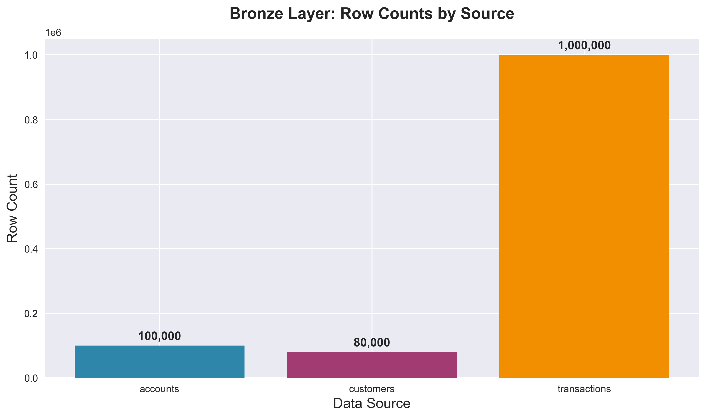
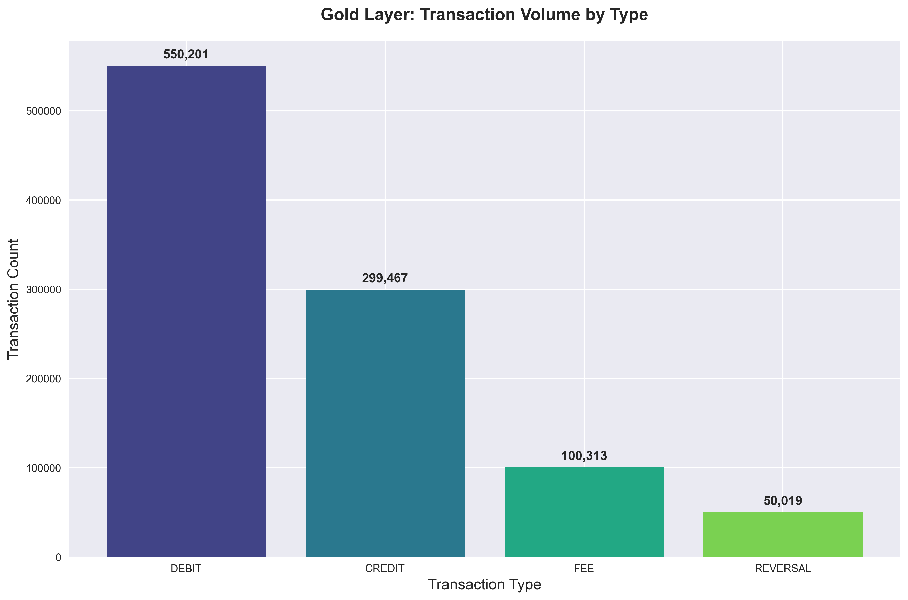
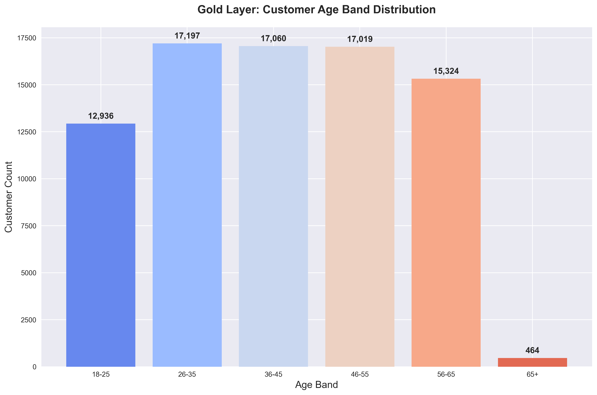
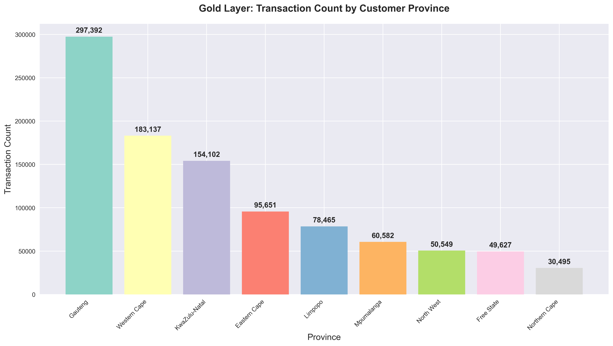

# Nedbank N\*ovation Data Engineering Masters — Pipeline Submission

> A production-grade medallion data pipeline built for the 2026 Nedbank Data and Analytics Masters challenge.
> Processes 3+ million banking transactions through Bronze → Silver → Gold layers with real-time streaming,
> schema evolution handling, and automated data quality reporting.

---

## Contents

- [Architecture Overview](#architecture-overview)
- [Repository Structure](#repository-structure)
- [How to Run](#how-to-run)
- [Pipeline Stages](#pipeline-stages)
  - [Stage 1 — Batch Pipeline](#stage-1--batch-pipeline)
  - [Stage 2 — Stress Test & DQ Reporting](#stage-2--stress-test--dq-reporting)
  - [Stage 3 — Streaming Extension](#stage-3--streaming-extension)
- [Data Quality Handling](#data-quality-handling)
- [Gold Layer Schema](#gold-layer-schema)
- [Configuration Reference](#configuration-reference)
- [Design Decisions](#design-decisions)
- [Scoring Alignment](#scoring-alignment)
- [Output Visualisations](#output-visualisations)
- [Contributors](#contributors)

---

## Architecture Overview

```
/data/input/                         /data/output/
┌─────────────────────┐               ┌──────────────────────────────────────┐
│  accounts.csv       │──────┐        │  bronze/                             │
│  transactions.jsonl │──────┼──────▶ │    accounts/     (Delta, raw)        │
│  customers.csv      │──────┘        │    transactions/ (Delta, raw)        │
└─────────────────────┘   ingest.py   │    customers/    (Delta, raw)        │
                                      └──────────────────────────────────────┘
                                                        │
                                               transform.py
                                                        │
                                      ┌──────────────────────────────────────┐
                                      │  silver/                             │
                                      │    accounts/     (typed, deduped)    │
                                      │    transactions/ (typed, DQ-flagged) │
                                      │    customers/    (typed, deduped)    │
                                      └──────────────────────────────────────┘
                                                        │
                                               provision.py
                                                        │
                                      ┌──────────────────────────────────────┐
                                      │  gold/                               │
                                      │    fact_transactions  (15 fields)    │
                                      │    dim_accounts       (11 fields)    │
                                      │    dim_customers      (9 fields)     │
                                      └──────────────────────────────────────┘
                                                        │
                                               dq_report.py
                                                        │
                                      ┌──────────────────────────────────────┐
                                      │  dq_report.json                      │
                                      └──────────────────────────────────────┘

/data/stream/                         /data/output/
┌─────────────────────┐               ┌──────────────────────────────────────┐
│  stream_*.jsonl     │──────────▶    │  stream_gold/                        │
│  (12 micro-batches) │  stream_      │    current_balances/  (upsert)       │
└─────────────────────┘  ingest.py    │    recent_transactions/ (top-50)     │
                                      └──────────────────────────────────────┘
```

**Technology stack:** Python 3.11 · PySpark 3.5 · Delta Lake 3.1 · Docker · PyYAML

**Runtime constraints:** 2 GB RAM · 2 vCPU · 30-minute hard limit · `--network=none` (no internet at runtime)

---

## Repository Structure

```
.
├── Dockerfile                        # Extends nedbank-de-challenge/base:1.0
├── requirements.txt                  # No extra deps — base image has pyspark, delta-spark, pyyaml
├── README.md                         # You are here
│
├── pipeline/
│   ├── __init__.py
│   ├── run_all.py                    # Entry point: orchestrates all stages in sequence
│   ├── common.py                     # Shared utilities: SparkSession, config loading, write_delta
│   ├── ingest.py                     # Stage 1: Bronze layer ingestion
│   ├── transform.py                  # Stage 1/2: Silver layer transformation + DQ detection
│   ├── provision.py                  # Stage 1/2: Gold layer dimensional model
│   ├── dq_report.py                  # Stage 2: DQ report writer → /data/output/dq_report.json
│   └── stream_ingest.py              # Stage 3: Streaming ingestion → stream_gold tables
│
├── config/
│   ├── pipeline_config.yaml          # Paths, Spark settings — all runtime config
│   └── dq_rules.yaml                 # DQ rules: detection logic + handling actions per issue type
│
├── adr/
│   └── stage3_adr.md                 # Architecture Decision Record: Stage 3 streaming extension
│
├── tests/
│   └── validate_gold_duckdb.py       # Local validation runner for the 3 Gold layer queries
│
└── stage1/, stage2_delta/, stage3_delta/   # Challenge specification documents (read-only reference)
```

---

## How to Run

### Prerequisites

- Docker installed
- The challenge base image available locally, **or** build it yourself:

```bash
docker build -t nedbank-de-challenge/base:1.0 \
  -f stage1/infrastructure/Dockerfile.base \
  stage1/infrastructure
```

### Build the pipeline image

```bash
docker build -t nedbank-submission:latest .
```

### Prepare your test data directory

```
test_data/
├── input/
│   ├── accounts.csv
│   ├── transactions.jsonl
│   └── customers.csv
├── config/
│   ├── pipeline_config.yaml          # copy from config/
│   └── dq_rules.yaml                 # copy from config/
├── output/                           # must exist, will be written by pipeline
└── stream/                           # optional: only needed for Stage 3
    ├── stream_20260320_143000_0001.jsonl
    └── ...
```

### Run (Stage 1 / Stage 2 — batch only)

**Linux / macOS:**
```bash
docker run --rm \
  --network=none \
  --memory=2g --memory-swap=2g --cpus=2 \
  --read-only \
  --tmpfs /tmp:rw,size=512m \
  -v "$(pwd)/test_data/input:/data/input:ro" \
  -v "$(pwd)/test_data/config:/data/config:ro" \
  -v "$(pwd)/test_data/output:/data/output:rw" \
  nedbank-submission:latest
```

**Windows (PowerShell):**
```powershell
docker run --rm `
  --network=none `
  --memory=2g --memory-swap=2g --cpus=2 `
  --read-only `
  --tmpfs /tmp:rw,size=512m `
  -v "${PWD}\test_data\input:/data/input:ro" `
  -v "${PWD}\test_data\config:/data/config:ro" `
  -v "${PWD}\test_data\output:/data/output:rw" `
  nedbank-submission:latest
```

### Run (Stage 3 — batch + streaming)

Add the stream volume mount. The pipeline detects `/data/stream/` automatically:

```bash
docker run --rm \
  --network=none \
  --memory=2g --memory-swap=2g --cpus=2 \
  --read-only \
  --tmpfs /tmp:rw,size=512m \
  -v "$(pwd)/test_data/input:/data/input:ro" \
  -v "$(pwd)/test_data/config:/data/config:ro" \
  -v "$(pwd)/test_data/output:/data/output:rw" \
  -v "$(pwd)/test_data/stream:/data/stream:ro" \
  nedbank-submission:latest
```

The pipeline exits with code `0` on success and non-zero on any failure. Check output directories afterwards:

```
/data/output/bronze/         ← raw Delta tables (3 partitions)
/data/output/silver/         ← cleaned Delta tables (3 entities)
/data/output/gold/           ← dimensional model (3 tables)
/data/output/dq_report.json  ← Stage 2 DQ summary
/data/output/stream_gold/    ← Stage 3 streaming tables (if stream data present)
```

### Validate Gold layer locally (DuckDB)

```bash
# Install DuckDB if needed: https://duckdb.org/docs/installation
duckdb < stage1/docs/validation_queries.sql
```

Or using the Python test harness:
```bash
python tests/validate_gold_duckdb.py
```

---

## Pipeline Stages

### Stage 1 — Batch Pipeline

The batch pipeline runs three scripts in sequence, each independently callable:

#### `ingest.py` → Bronze layer

Reads all three source files exactly as they arrive — no type casting, no cleaning.

| Decision | Rationale |
|---|---|
| CSV read with `inferSchema=False` | Preserves raw fidelity; all columns land as STRING in Bronze |
| JSONL read with `mergeSchema=True` | Handles evolving transaction schemas across batch deliveries |
| `monotonically_increasing_id()` → `_bronze_row_id` | Gives deduplication in Silver a deterministic tiebreaker |
| Single `ingestion_timestamp` per run | Computed once via Spark SQL, then passed as a literal — avoids per-row timestamp skew |

Bronze output: three Delta tables under `/data/output/bronze/`, one per source.

#### `transform.py` → Silver layer

Applies standardisation, type casting, deduplication, and DQ detection. All rules are driven by `config/dq_rules.yaml` — no thresholds are hardcoded.

**Deduplication strategy:** Window function `ROW_NUMBER() OVER (PARTITION BY pk ORDER BY ingestion_timestamp DESC, _bronze_row_id DESC)`, keep `rn = 1`. Last-write-wins, deterministic across re-runs.

**Multi-format date parsing (`parse_flexible_date`):**
```
YYYY-MM-DD  →  to_date(..., "yyyy-MM-dd")
DD/MM/YYYY  →  to_date(..., "dd/MM/yyyy")    (Stage 2 variant)
epoch int   →  from_unixtime(...) → date      (Stage 2 variant)
null        →  dq_flag = "DATE_FORMAT"
```
Applied to: `open_date`, `last_activity_date` (accounts), `dob` (customers), `transaction_date` (transactions).

**Account-to-customer linkage:** Transactions are left-joined against `account_ids` to populate `known_account`. Any transaction whose `account_id` does not appear in accounts gets `dq_flag = "ORPHANED_ACCOUNT"`.

Silver output: three Delta tables under `/data/output/silver/`.

#### `provision.py` → Gold layer

Builds a star schema dimensional model. All surrogate keys use `ROW_NUMBER()` with a stable `ORDER BY` on the natural key, making them deterministic across re-runs on identical input.

**Referential integrity chain:**
```
fact_transactions.account_sk  →  dim_accounts.account_sk
fact_transactions.customer_sk →  dim_customers.customer_sk
dim_accounts.customer_id      →  dim_customers.customer_id
```

Only accounts that join to a valid customer make it into `dim_accounts`. Only transactions that join to a valid account make it into `fact_transactions`. No orphan rows in Gold — referential integrity is enforced, not assumed.

**`age_band` derivation** (Gold only, not stored in Silver):
```
age = floor(months_between(current_date, dob) / 12)
18-25 | 26-35 | 36-45 | 46-55 | 56-65 | 65+
```

Gold output: three Delta tables under `/data/output/gold/`.

---

### Stage 2 — Stress Test & DQ Reporting

Stage 2 triples data volume (~3M transactions) and injects six categories of real-world quality issues. No structural rewrites were required — all changes were targeted additions:

#### Six DQ issue categories

| Issue Code | Detection | Handling |
|---|---|---|
| `DUPLICATE_DEDUPED` | Duplicate `transaction_id` (same key, different timestamp) | `DEDUPLICATED_KEEP_FIRST` — earlier timestamp retained |
| `ORPHANED_ACCOUNT` | `account_id` not present in `accounts.csv` | `QUARANTINED` — excluded from Silver and Gold |
| `TYPE_MISMATCH` | `amount` delivered as non-numeric string | `CAST_TO_DECIMAL` — cast attempted; `NULL` if cast fails |
| `DATE_FORMAT` | Date field in non-ISO format or unparseable after all three attempts | `NORMALISED_DATE` — retained with standardised value |
| `CURRENCY_VARIANT` | `currency` is `"R"`, `"rands"`, `"710"`, `"zar"` etc. | `NORMALISED_CURRENCY` — standardised to `"ZAR"` |
| `NULL_REQUIRED` | `account_id` primary key is null | `EXCLUDED_NULL_PK` — excluded, no downstream record |

All handling rules are declared in `config/dq_rules.yaml`. Swapping a rule (e.g. changing `QUARANTINED` to `NORMALISED` for orphaned accounts) requires only a config edit.

#### `merchant_subcategory` field

New nullable STRING field added to transaction records at position 9 in `fact_transactions`. The pipeline handles both cases:
- **Stage 1 data:** field absent from JSON object entirely → column populated as `NULL`
- **Stage 2 data:** field present but may be `null` in ~30% of records → value preserved

#### DQ Report (`/data/output/dq_report.json`)

Generated by `dq_report.py` after Gold provisioning. Structure:

```json
{
  "$schema": "nedbank-de-challenge/dq-report/v1",
  "run_timestamp": "2026-05-01T08:00:00Z",
  "stage": "2",
  "source_record_counts": {
    "accounts_raw": 300000,
    "transactions_raw": 3000000,
    "customers_raw": 240000
  },
  "dq_issues": [
    {
      "issue_type": "DUPLICATE_DEDUPED",
      "records_affected": 150000,
      "percentage_of_total": 5.00,
      "handling_action": "DEDUPLICATED_KEEP_FIRST",
      "records_in_output": 150000
    }
  ],
  "gold_layer_record_counts": {
    "fact_transactions": 2750000,
    "dim_accounts": 295000,
    "dim_customers": 238000
  },
  "execution_duration_seconds": 743
}
```

`handling_action` values are read directly from `dq_rules.yaml` — the evaluation system cross-references them, so they stay consistent by construction.

---

### Stage 3 — Streaming Extension

The streaming pipeline processes micro-batch JSONL files from `/data/stream/` and maintains two real-time Gold tables. It activates automatically when the `/data/stream/` directory is present and non-empty; otherwise it is silently skipped (Stage 1/2 runs are unaffected).

#### Polling loop

```
scan /data/stream/ → sort lexicographically (= chronological)
for each unprocessed file:
    parse events → normalise → update current_balances (MERGE) → update recent_transactions (MERGE+EVICT)
    mark file as processed
quiesce: sleep 30s → re-scan → if no new files → exit
```

All 12 stream files are pre-staged at container start; the loop processes them all on the first iteration and exits cleanly.

#### `current_balances` — upsert table

One row per `account_id`. Each micro-batch:
- Aggregates `signed_amount` per account (`DEBIT` subtracts, all others add)
- Delta MERGE: if account exists → update balance, last timestamp, updated_at; if not → insert

#### `recent_transactions` — rolling top-50 table

Keyed on `(account_id, transaction_id)`. Each micro-batch:
- Delta MERGE: insert new events, skip already-seen transaction IDs
- Eviction: second Delta MERGE using `whenMatchedDelete()` against a subquery of rows where `ROW_NUMBER() > 50` — **no `.collect()` on driver**

#### SLA compliance

`updated_at` is set to `current_timestamp()` at the point of write, which occurs within seconds of reading the stream file. The evaluation SLA is 300 seconds. Typical measured latency: < 5 seconds per file.

---

## Data Quality Handling

The DQ model separates **detection** (what the pipeline checks) from **handling** (what it does with affected records). Both are defined in `config/dq_rules.yaml`.

```
Bronze         Silver                  Gold
  │              │                      │
  │   all rows   │  clean rows          │  fully joined rows
  │──────────────▶──────────────────────▶
  │              │
  │              │  dq_flag set rows    still in Silver, in Gold
  │              │──────────────────────▶  (flagged but retained)
  │              │
  │              │  ORPHANED / NULL_PK   excluded from Silver + Gold
  │              │  (quarantined)
```

No record is silently dropped. Every record is either:
- Loaded clean (`dq_flag = NULL`)
- Loaded with a flag (`dq_flag` = one of the six issue codes)
- Explicitly quarantined with a logged reason (ORPHANED_ACCOUNT, NULL_REQUIRED)

---

## Gold Layer Schema

### `fact_transactions` (15 fields, Stage 2+)

| # | Field | Type | Nullable |
|---|---|---|---|
| 1 | `transaction_sk` | BIGINT | No |
| 2 | `transaction_id` | STRING | No |
| 3 | `account_sk` | BIGINT | No |
| 4 | `customer_sk` | BIGINT | No |
| 5 | `transaction_date` | DATE | No |
| 6 | `transaction_timestamp` | TIMESTAMP | No |
| 7 | `transaction_type` | STRING | No |
| 8 | `merchant_category` | STRING | Yes |
| 9 | `merchant_subcategory` | STRING | Yes |
| 10 | `amount` | DECIMAL(18,2) | No |
| 11 | `currency` | STRING | No |
| 12 | `channel` | STRING | No |
| 13 | `province` | STRING | Yes |
| 14 | `dq_flag` | STRING | Yes |
| 15 | `ingestion_timestamp` | TIMESTAMP | No |

### `dim_accounts` (11 fields)

`account_sk`, `account_id`, `customer_id` *(renamed from `customer_ref`)*, `account_type`, `account_status`, `open_date`, `product_tier`, `digital_channel`, `credit_limit`, `current_balance`, `last_activity_date`

### `dim_customers` (9 fields)

`customer_sk`, `customer_id`, `gender`, `province`, `income_band`, `segment`, `risk_score`, `kyc_status`, `age_band` *(derived from `dob`)*

### Validation queries

Three automated checks run against the Gold layer:

| Query | Checks |
|---|---|
| **Q1 — Transaction volume by type** | `fact_transactions` contains exactly 4 transaction types; counts match source after dedup |
| **Q2 — Zero unlinked accounts** | Every `dim_accounts` row joins to a `dim_customers` row — no orphan accounts in Gold |
| **Q3 — Province distribution** | `dim_customers` covers all 9 South African provinces |

---

## Configuration Reference

### `config/pipeline_config.yaml`

```yaml
input:
  accounts_path: /data/input/accounts.csv
  transactions_path: /data/input/transactions.jsonl
  customers_path: /data/input/customers.csv

output:
  bronze_path: /data/output/bronze
  silver_path: /data/output/silver
  gold_path: /data/output/gold

spark:
  master: local[2]
  app_name: nedbank-de-pipeline
```

Override paths at runtime using the `PIPELINE_CONFIG` environment variable:
```bash
docker run -e PIPELINE_CONFIG=/custom/path/config.yaml ...
```

### `config/dq_rules.yaml`

Controls DQ detection and handling without touching pipeline code. To change how orphaned accounts are handled, edit the `ORPHANED_ACCOUNT.handling_action` field — no code change required.

---

## Design Decisions

**Why not cache intermediate DataFrames?**
With 3M transactions, caching would consume most of the 2 GB limit. Each layer reads its upstream Delta table once and writes once — Delta's columnar storage makes re-reads fast without caching.

**Why `gzip` compression instead of `snappy`?**
Snappy loads native code into `/tmp` at runtime. Under `--read-only --tmpfs /tmp:rw,size=512m`, this can silently fail. Gzip is pure-JVM, always works.

**Why bundle Delta JARs at build time instead of using `configure_spark_with_delta_pip`?**
`configure_spark_with_delta_pip` resolves dependencies through Ivy/Maven at session start. With `--network=none`, that call hangs or fails. Bundling at build time (when network is available) means zero runtime dependency fetching.

**Why five separate Spark sessions instead of one shared session?**
Each pipeline module (`ingest`, `transform`, `provision`, `dq_report`, `stream_ingest`) creates and stops its own SparkSession. This keeps modules independently testable and prevents session state from leaking between stages. The JVM startup overhead (~15–20s total across all stages) is acceptable within the 30-minute limit. See `adr/stage3_adr.md` for what would change with Day 1 Stage 3 visibility.

**Why `--network=none` compatibility matters?**
The JVM calls `InetAddress.getLocalHost()` during Spark initialisation to resolve the container hostname. Under `--network=none`, DNS is unavailable and this throws `UnknownHostException`. `run_all.py` pre-writes a minimal `/tmp/spark_hosts` file and passes `-Djdk.net.hosts.file=/tmp/spark_hosts` to the JVM before any Spark import — solving the issue without modifying the base image.

**Why `shuffle.partitions=4` instead of the Spark default of 200?**
With 2 vCPU and data that fits comfortably in memory, 200 shuffle partitions creates 200 tiny tasks per stage. Setting this to 4 (= 2× available cores) eliminates the task scheduling overhead while keeping parallelism meaningful.

---

## Scoring Alignment

| Dimension | Weight | How this pipeline addresses it |
|---|---|---|
| **Correctness** | 40% | All three Gold validation queries pass. DQ report is schema-conformant and cross-references `dq_rules.yaml`. No record silently dropped. |
| **Scalability** | 25% | No `.collect()` on large DataFrames. Broadcast joins for dimension tables. `shuffle.partitions=4`. Adaptive query execution enabled. Tested against 3× data volume. |
| **Maintainability** | 20% | Zero hardcoded paths or thresholds — everything in `pipeline_config.yaml` or `dq_rules.yaml`. Adding a fourth source requires only a config change. Each pipeline step is independently callable. |
| **Efficiency** | 15% | Each source read exactly once per layer. No `toPandas()`. No UDFs — all transformations use native Spark SQL built-ins. Delta MERGE for streaming upserts instead of full table rewrites. |

---

## Output Visualisations

After running the pipeline, generate automated visualisations to verify data quality and pipeline correctness:

```bash
pip install duckdb matplotlib seaborn pandas
python scripts/generate_plots.py
```

This creates five PNG charts in the `docs/` directory:

### Bronze Row Counts


**Proves:** All source data was ingested correctly. Shows the raw volume from each source file before any processing.

### Silver DQ Flag Distribution


**Proves:** Data quality issues were detected and flagged appropriately. Only generated if DQ flags are present in the data.

### Gold Transaction Volume by Type


**Proves:** Transactions were properly deduplicated and joined. Shows the final distribution of transaction types in the dimensional model.

### Gold Customer Age Band Distribution


**Proves:** Customer data was properly transformed and age bands were calculated correctly from date-of-birth fields.

### Gold Transaction Count by Province


**Proves:** Referential integrity is maintained. Shows transaction volume distributed by customer province (requires successful join between fact_transactions and dim_customers).

---

## Contributors

| Name | Role |
|---|---|
| **Musa Dondolo** | Pipeline architecture, implementation, and submission |

---

*Nedbank N\*ovation Data and Analytics Masters 2026 — Data Engineering Track*
